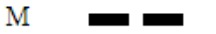

# STM32MORSE
##  SEEL 5123 (Advanced Microprocessor) Assignment part 1 (device and tool setup and test)
### Group members: 
1. Mohamed Afifi Ahmed Mahmoud Khalil  
2. Mahmoud Abdelwase Mahmoud  
3. Omar Amgad elsayed abdelmonem  

### Task Description: 
Blink the LEDs to transmit 3 letters representing the group members' names. In the case of this group, the letters are A, M and O.

### Solution: 
Before getting to blinking the LEDs, we need to break down how the morse code will be represented. Morse code is made up of dots and dashes where each sequence represents a letter. For our application, lighting an LED for a shorter period represents a dot while lighting it for a longer period represents a dash. The longest delay applied will represent a delimiter between the different letters. The following images show the morse code representation for each of the letters (A, M and O).  

  
  
  
  
  

The code implementation was split to functions to keep the main loop simple and readable. Following are the steps taken to implement the code.  

1. define the delay durations  
```
# define LONG_DELAY   600
# define SHOFT_DELAY  100
# define BUFFER_DELAY 1500  // delay between letters
```  

2. Implement a function to blink the on-board LED once at a given input rate. 
```  
void blink_led (int time) {
	HAL_GPIO_TogglePin(LD4_GPIO_Port, LD4_Pin);
	HAL_Delay(time);
	HAL_GPIO_TogglePin(LD4_GPIO_Port, LD4_Pin);
	HAL_Delay(time);
}
```  

3. implement a function to blink the LED following a given letter's morse code pattern
```  
void morse_blink (char letter) {
	// A is . _
	// M is _ _
	// O is _ _ _
	int i = 0;

	HAL_Delay(BUFFER_DELAY);
	if (letter == 'A') {
		blink_led(SHOFT_DELAY);
		HAL_Delay(100);
		blink_led(LONG_DELAY);
		HAL_Delay(BUFFER_DELAY);

	} else if (letter == 'M') {
		blink_led(LONG_DELAY);
		HAL_Delay(100);
		blink_led(LONG_DELAY);
		HAL_Delay(BUFFER_DELAY);

	} else if (letter == 'O') {
		blink_led(LONG_DELAY);
		HAL_Delay(100);
		blink_led(LONG_DELAY);
		HAL_Delay(100);
		blink_led(LONG_DELAY);
		HAL_Delay(BUFFER_DELAY);

	} else {
		// wrong input
		for (i = 0; i < 10; i++) {
			blink_led(200);
		}
	}
}
```

4. Write the main loop  
```  
  while (1)
  {
    /* USER CODE END WHILE */
    MX_USB_HOST_Process();

    /* USER CODE BEGIN 3 */
    // group member name first letters are (A, M and O)
    morse_blink('A');
    morse_blink('M');
    morse_blink('O');
  }
  /* USER CODE END 3 */
}
```  

### Video link:  
[Morse code LED blinking](https://drive.google.com/file/d/1v7gH_lfSQYMPK5qmTrXQEpC2yKCuaSEa/view?usp=sharing)
